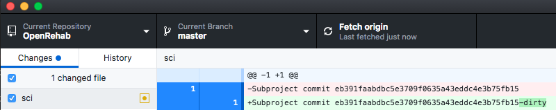

# <span style="display:block;text-align:center"></span>

## Introduction

Residents use their mobile devices frequently throughout the day for reference apps and websites such as UpToDate, Epocrates, Medscape.  However, the information is generalized and lacks useful information specific to a particular residency program. We have developed an open-source web app designed as a reference for use on rehab medicine rotation that users with little to no experience can:

1. download from a code repository
2. customize to their residency program
3. create new features
4. push new features back to the repository to contribute to the project.

If you just want to see a **live demo** of the software, view it at [https://marzloffmedia.com/sci](https://marzloffmedia.com/sci) or [https://marzloffmedia.com/tbi](https://marzloffmedia.com/tbi). These URLs will update to [mssm.edu](https://mssm.edu) servers soon. 

If you want to **quickly get your own "out-of-the-box" copy working**, have git installed and are comfortable with using the command line, see [Basic Installation](#basic-installation) below.

If you are completely new to HTML and git and would like to learn how to customize your own reference app for your program, please try [the tutorial](https://github.com/gmarzloff/OpenRehab-SCI/) located in the [OpenRehab-SCI](https://github.com/gmarzloff/OpenRehab-SCI/) repository. 

## Basic Installation
In a terminal, assuming you have git installed, type: 

```
$ git clone --recurse-submodules https://github.com/gmarzloff/OpenRehab.git
$ cd OpenRehab
$ python -m SimpleHTTPServer 8000
```
Then open the web app in a browser: [http://localhost:8000](http://localhost:8000)

## View on Mobile device
While your SimpleHTTPServer is running, you can view the app on your phone or tablet, though this device must be connected to the same network as your computer (now webserver). First find out your computer's ip address. In OSX, you can run 

```
$ ifconfig | grep "inet " | grep -v 127.0.0.1 | cut -d\  -f2
```
In Windows, click Start -> Run -> cmd (enter)-> ipconfig (enter)

The address probably starts with 192.168.1.something. Type this address without the [ ] in your mobile browser: ``` http://[ip address]:8000 ```

## More Details

1. The web apps use the [Framework7](https://framework7.io) library, but the full library does not need to be downloaded from that link for OpenRehab to work. When you are ready to customize your web apps, we recommend you download it to see code examples and understand its features.

2. If you want to use this web app as a template for a customized version to your program, **fork** this repository first. 

3. This repository contains a landing page (index.html) that allows multiple OpenRehab web apps to run. You must run this in a web server, because the web apps make asynchronous requests. To start a web server, in a terminal, type ```cd OpenRehab```, run ```python -m SimpleHTTPServer 8000``` (or ```python -m http.server 8000``` for python 3) where 8000.  When you want to kill the server later, type Ctrl+C. There are many other server options to run this such as Apache, Node.js, and nginx. 

## Advanced Users: Working with the submodules

OpenRehab stores the actual web apps (TBI, SCI, etc) as submodules, or "sub-repositories" nested within the OpenRehab repository. Each submodule keeps its own independent revision history, and OpenRehab simply creates a link to a specific commit of that repository. Switch to Github Desktop, and look at the Changes tab: 



You can see that the repository recognizes a change happened to the submodule, but it doesn't monitor what actually changed. For that, you need to switch to your `OpenRehab-SCI` forked repository. More details to come.
 

### Choosing Web Apps to include
The currently available submodules include:

  * Spinal Cord Injury (SCI)
  * Brain Injury (TBI)
  
 ### Add/Remove Link Buttons
 To do
 
 ### Add gitmodules
 To do
 
 ### Delete specific web apps
 If you want to remove a specific web app, you must delete its submodule references by running the following commands in a terminal ([source](https://davidwalsh.name/git-remove-submodule)).
 
